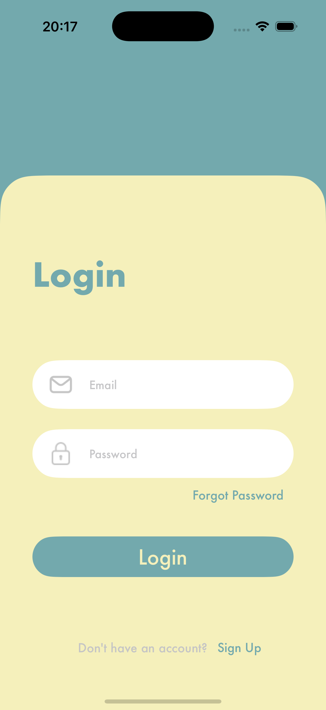
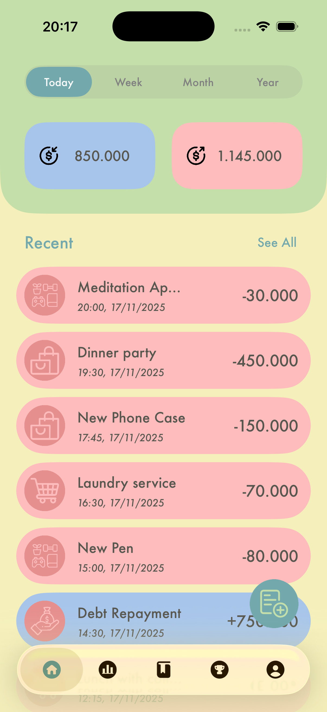
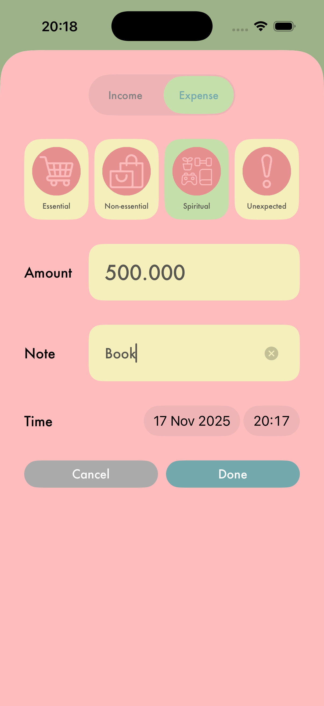
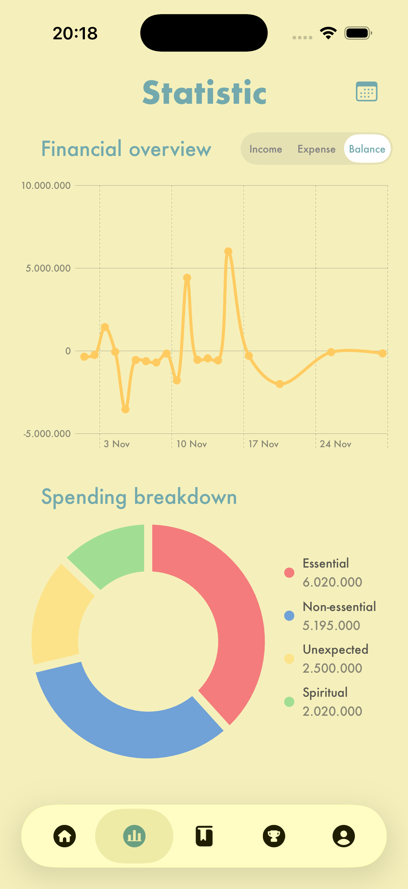
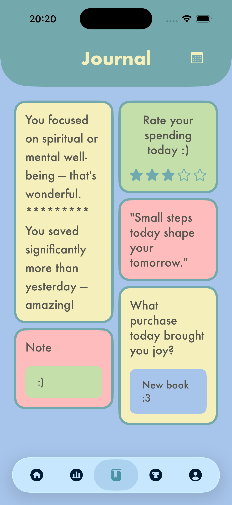
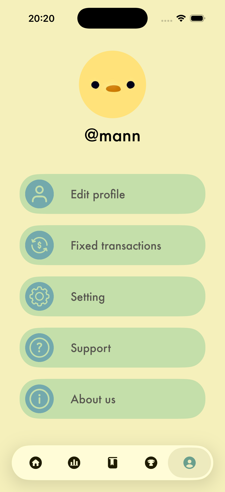
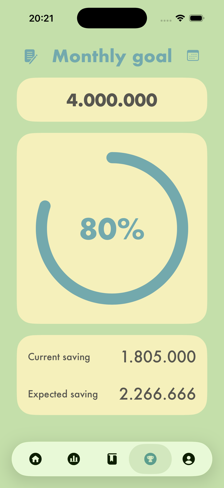

# ⭐ ZenWallet  
### Full-Stack Personal Finance App (iOS UIKit + Node.js + PostgreSQL)

ZenWallet is a clean and modern personal finance application that helps users track expenses, manage saving goals, and view financial insights through native iOS charts.  
This repository contains both the iOS application and the backend API.

---

## 📸 Screenshots

<p float="left">
  
  
  
</p>

<p float="left">
  
  
  
</p>

<p float="left">
  
  
</p>

---

## 📂 Project Structure

```
zenwallet/
 ├── zenwallet-app/         # iOS application (UIKit + MVVM)
 ├── zenwallet-backend/     # Backend API (Node.js + Express)
 ├── database/              # SQL schema and optional seed data
 ├── screenshots/
 ├── README.md
 └── .gitignore
```

---

## 📱 iOS App (UIKit)

ZenWallet’s iOS app is built with **UIKit**, structured using **MVVM**, and integrates **Swift Charts** for visualization.

### Key Features
- Add, edit, delete transactions  
- Income and expense categorization  
- Monthly saving goals  
- Line chart, pie chart  
- Custom UI components (progress bar, tab bar, cell views)  
- JWT authentication  
- Clean and minimal interface  

### Technologies Used
- Swift 6
- UIKit  
- AutoLayout + XIB  
- Swift Charts (via SwiftUI wrapper)  
- MVVM architecture  
- Alamofire  

Source folder: `zenwallet-app/`

---

## 🖥 Backend API (Node.js)

The backend provides secure APIs for authentication, transactions, and financial statistics.

### Features
- JWT-based authentication  
- CRUD operations for transactions  
- Monthly saving goals  
- Statistics calculation  
- PostgreSQL integration  

### Technologies
- Node.js + Express  
- PostgreSQL  
- pg library  
- bcrypt / JWT  

Source folder: `zenwallet-backend/`

---

## 🔗 API Endpoints Overview

### Transactions
```
GET    /api/transactions
POST   /api/transactions
PATCH  /api/transactions/:id
DELETE /api/transactions/:id
```

### Goals
```
GET    /api/goals
POST   /api/goals
PATCH  /api/goals/:id
```

### Auth
```
POST   /api/auth/login
POST   /api/auth/register
```

---

## 🚀 Getting Started

### 1. Clone the Repository
```sh
git clone https://github.com/ngminhan/zen-wallet.git
cd zenwallet
```

---

## 🖥 Run the Backend
```sh
cd zenwallet-backend
npm install
npm start
```

Create an environment file:
```sh
cp .env.example .env
```

---

## 🗄 Database Setup

Import schema:
```sh
psql -d zenwallet_db -f schema.sql
```

Optional seed:
```sh
psql -d zenwallet_db -f seed.sql
```

Default API URL:
```
http://127.0.0.1:3000
```

---

## 📱 Run the iOS App
```sh
cd zenwallet-app
open ZenWallet.xcodeproj
```

Requirements:
- macOS 13+  
- Xcode 15+  
- iOS 17+  

Run using Command + R.

---

## 🔑 Demo Login

For testing the app, use the following account:

Email: demo@zenwallet.com  
Password: demo1234


## 🗺 Roadmap
- Dark Mode  
- CSV/Excel export  
- Budget planning  
- Notifications  
- Multi-user support  
- iCloud sync  

---

## 👤 Author
**Nguyễn Minh An**  
HEDSPI (Vietnam–Japan IT Program)  
Hanoi University of Science and Technology

---

## 📄 License
MIT License. 
Feel free to use or contribute.
